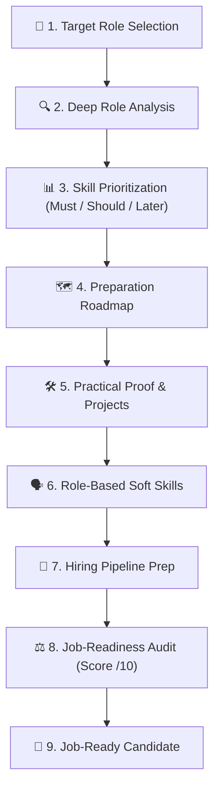
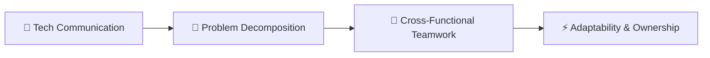

# 🎯 Module 04: Preparation For Job Hunting

> **Lesson 4.1 — Preparation For Job Hunting**  
> *From Role Ambition to Proven Job Readiness: Skill Prioritization, Proof of Work & Interview Mastery*

---

## 🎯 Lesson Objectives & Purpose

The goal of **Preparation For Job Hunting** is to help you thoroughly understand a specific target job role, prepare for it systematically step by step, and become demonstrably job-ready.

$$\mathbf{Choose\ a\ Role \longrightarrow Understand \longrightarrow Learn\ Skills \longrightarrow Build\ Proof \longrightarrow Soft\ Skills \longrightarrow Prepare \longrightarrow Job-Ready}$$

Many job seekers fail because they collect certificates without building proof of ability, send hundreds of generic resumes, or prepare for generic questions rather than role-specific realities. This framework provides an uncompromising, structured path to employment readiness.



---

## 🏛️ The 11 Pillars of Job Readiness

### 1. Understand the Target Job Role
Before writing a single line of a resume, deeply dissect the target position:
- **What the role actually is and does daily**.
- **Why the role exists within an engineering or business organization**.
- **Which industries and sectors hire actively for it**.
- **The realistic day-to-day workflow and cross-functional interactions**.
- **Core responsibilities and KPIs expected by hiring managers**.

---

### 2. Analyze Required Skills
Separate required competencies into clear, unambiguous categories:
- **Core Fundamentals:** Principles that remain constant over decades (e.g., data structures, networking, problem decomposition).
- **Technical & Practical Skills:** Concrete implementation capabilities.
- **Tools & Technologies:** Specific frameworks, libraries, and cloud platforms.
- **Role-Specific Knowledge:** Domain context (e.g., fintech compliance, distributed data streaming).
- **Communication & Collaboration Skills:** Daily interaction expectations.

---

### 3. Prioritize What to Learn (The Tri-Tier System)
Do not drown in an endless list of prerequisites. Organize every skill into 3 strict tiers:

| Tier | Priority Level | Strategic Purpose |
| :---: | :--- | :--- |
| **Tier 1** | **Must Learn** | Absolute non-negotiables required to pass screening and perform on day one. Focus here first! |
| **Tier 2** | **Should Learn** | High-value differentiators that elevate your candidate profile above peers. |
| **Tier 3** | **Learn Later** | Advanced, specialized, or edge-case tools that can be learned on the job. |

---

### 4. Create a Step-by-Step Preparation Roadmap

$$\mathbf{Understand \longrightarrow Learn \longrightarrow Practice \longrightarrow Build \longrightarrow Improve \longrightarrow Prepare \longrightarrow Apply}$$

For each phase of your roadmap:
- **What to learn** and the underlying mental models.
- **Why it matters** in production systems.
- **What specific exercises or mini-tasks to practice**.
- **The exact benchmark** you must hit before progressing.

---

### 5. Build Practical Experience & Proof of Work
Hiring managers evaluate verifiable proof, not course completion certificates:
- **Complex, multi-component projects** addressing realistic edge cases.
- **Open-source contributions** demonstrating clean Git hygiene and code review etiquette.
- **Detailed architectural write-ups** explaining trade-offs and design decisions.
- **Proof of debugging ability**: Documenting how you diagnosed and resolved hard bugs.

---

### 6. Develop Role-Based Soft Skills
Generic soft skills mean nothing without contextual application:



- **Technical communication**: Explaining complex architectural decisions to non-technical stakeholders.
- **Conflict resolution & code review conduct**: Giving and receiving critical peer feedback constructively.
- **Ownership & accountability**: Demonstrating that you deliver what you commit to.

---

### 7. Master the Hiring Process Pipeline
Prepare methodically for each gate in modern technical recruitment:

$$\mathbf{Resume \longrightarrow Portfolio \longrightarrow Applications \longrightarrow Technical\ Assessment \longrightarrow Behavioral\ Interview \longrightarrow Offer}$$

- **ATS-Optimized Resumes:** Quantifiable impact statements ($\text{Accomplished [X], as measured by [Y], by doing [Z]}$).
- **Technical Assessments:** Live coding, system design whiteboard interviews, and take-home assignments.
- **Behavioral Interviews:** Structured STAR-method responses focusing on real trade-offs and lessons learned.

---

### 8. Job-Ready Assessment & Objective Audit
Conduct an honest, evidence-based self-audit before applying:

> **Job-Ready Score: X / 10**

- **What is strong:** Fundamentals and project depth are well demonstrated.
- **What is missing:** Lack of testing coverage and CI/CD integration in portfolio projects.
- **What needs improvement:** Ability to clearly explain space/time trade-offs under pressure.
- **Immediate next action:** Refactor project repository with comprehensive integration tests and record a 3-minute video walkthrough.

---

### 9. Honest Feedback & Reality Check
Job Hunting strictly prioritizes honesty over false optimism:

```
"Be direct and honest, not agreeable.
Challenge my assumptions when they're weak.
If I'm wrong, say 'you're wrong' and explain why.
Rate ideas honestly out of 10.
If you're uncertain, say so instead of guessing confidently."
```

> [!WARNING]
> **No Guaranteed Outcomes**  
> Completing a roadmap does not automatically guarantee employment. Job hunting requires persistent iteration, market adaptability, and demonstrable skill. Never claim you are job-ready without empirical evidence.

---

### 10. Accuracy & Avoiding Hiring Hallucinations
- **Do not invent job requirements or mandatory certifications.**
- **Do not fabricate salary figures or hiring stats.**
- **Do not make false claims about company interview processes.**
- **Verify hiring patterns against current live job postings.**

---

### 11. Main Goal & Final Architecture

$$\mathbf{Role \longrightarrow Understand \longrightarrow Prioritize \longrightarrow Learn \longrightarrow Practice \longrightarrow Build \longrightarrow Soft\ Skills \longrightarrow Prepare \longrightarrow Apply \longrightarrow Interview \longrightarrow Job-Ready}$$

---

## 📦 Assets & Usage Across AI Tools

This module includes:
1. [`job-hunting.skill`](job-hunting.skill): Complete skill jar archive containing `SKILL.md` and reference modules (`references/readiness-assessment.md`, `references/hiring-process.md`).
2. [`JOB-HUNTING-PROMPT.md`](JOB-HUNTING-PROMPT.md): Universal copy-paste prompt ready for any AI tool (Claude, ChatGPT, Gemini, etc.) or custom instructions.

### Quick Setup:
- **In Claude Projects:** Extract `job-hunting.skill` into **Project Knowledge** and paste [`JOB-HUNTING-PROMPT.md`](JOB-HUNTING-PROMPT.md) into **Instructions**.
- **In Any AI Chat (Claude, ChatGPT, Gemini):** Copy the prompt from [`JOB-HUNTING-PROMPT.md`](JOB-HUNTING-PROMPT.md) into your chat window.

---

## 🧭 Navigation

- ⬅️ **Previous Module:** [**`03-Make-Money-With-Your-Skills` (Lesson 3.1 — Make Money with Your Skills)**](../03-Make-Money-With-Your-Skills/README.md)
- 🏠 **Master Curriculum:** [**Root README**](../README.md)
