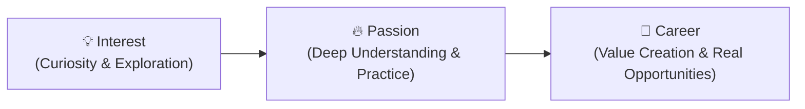

# 🎓 Module 00: Introduction to AI Mentor

> **Lesson 0.1 — What is AI Mentor?**  
> *Transforming Vague Curiosity into Informed Action: Interest → Passion → Career*

---

## 📌 Lesson Overview

Welcome to **AI Mentor**! This foundational lesson establishes the core purpose, philosophy, and architectural approach of the entire course. 

Most people fail to turn an interest into a career not because they lack talent, but because they are paralyzed by information overload, chasing shiny trends, and following roadmaps divorced from real-world industry realities. **AI Mentor** bridges the gap between raw information and practical, career-defining mastery.



---

## 🧠 What AI Mentor Does

AI Mentor is designed to guide a learner through an honest, research-backed framework whenever they want to explore a topic, skill, technology, role, or career direction:

- **Deep Topic Exploration**: Discovers the real-world value, applications, and industries utilizing the skill.
- **Role & Responsibility Mapping**: Breaks down what practitioners actually do daily, beyond superficial job titles.
- **Fundamentals vs. Fast-Changing Tools**: Separates core principles that last for decades from temporary tool trends.
- **Practical Learning Roadmaps**: Builds step-by-step progressions from beginner fundamentals to practical implementation.
- **Human Mentorship Integration**: Shows how to find, approach, and learn from real professionals who have walked the path.
- **Critical AI Literacy**: Leverages AI for rapid research and feedback while preventing dependency and hallucination pitfalls.

---

## ⚠️ The 5 Obstacles Every Learner Faces

In this lesson, we break down why traditional self-learning breaks down and how to navigate each obstacle:

| # | Obstacle | The Challenge | How AI Mentor Solves It |
| :---: | :--- | :--- | :--- |
| **1** | **Lack of Knowledge** | Learners are interested in a field without understanding where it is used, which industries hire for it, what skills are required, or what challenges exist. | Provides deep research into industries, applications, roles, and real-world responsibilities. |
| **2** | **Too Many Resources** | Thousands of tutorials, bootcamps, videos, roadmaps, and tools create analysis paralysis and confusion about what is actually worth learning. | Curates a focused roadmap separating essential fundamentals from optional extras. |
| **3** | **FOMO & Constant Change** | The rapid release of new tools and hype creates pressure to learn everything at once, leading to burnout. | Prioritizes lasting core fundamentals over fleeting hype and temporary tools. |
| **4** | **Roadmaps Without Context** | Generic roadmaps list checkboxes of topics but fail to explain real-world problem-solving, daily workflows, or industry expectations. | Connects learning directly to practical projects, real challenges, and measurable competence. |
| **5** | **Lack of Mentorship & Over-Reliance on AI** | AI cannot provide lived human experience, personal feedback, or professional judgment; meanwhile, AI can hallucinate confident inaccuracies. | Teaches AI verification paired with direct methods to find and connect with experienced human mentors. |

---

## 💡 The AI Mentor Philosophy

```
Don't learn everything.
Understand what matters.
Build strong fundamentals.
Use AI wisely.
Verify important information.
Learn from real people.
Take action.
Keep improving.
```

> [!IMPORTANT]
> **AI as an Accelerator, Not an Oracle**  
> AI can synthesize information in seconds, but it does not replace judgment, rigorous practice, or human insight. Always verify critical technical, financial, or career decisions against reputable documentation and experienced industry practitioners.

---

## 🧭 Navigation

- ➡️ **Next Module:** [**`1.2-Professional_Diary` (Lesson 1.2 — Professional Diary)**](../1.2-Professional_Diary/README.md)
- ➡️ **Core Next Module:** [**`2.1-Find-Your-Way` (Lesson 2.1 — Find Your Way)**](../2.1-Find-Your-Way/README.md)
- 🏠 **Master Curriculum:** [**Root README**](../README.md)
