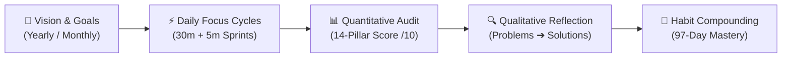
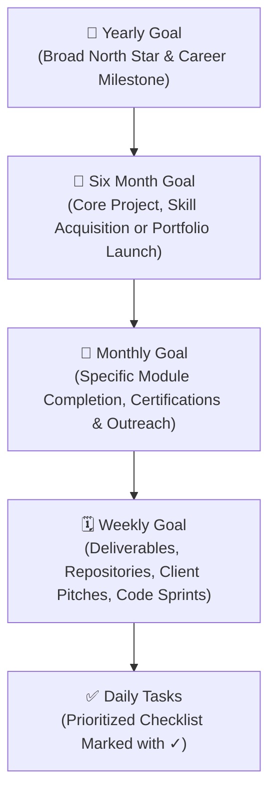
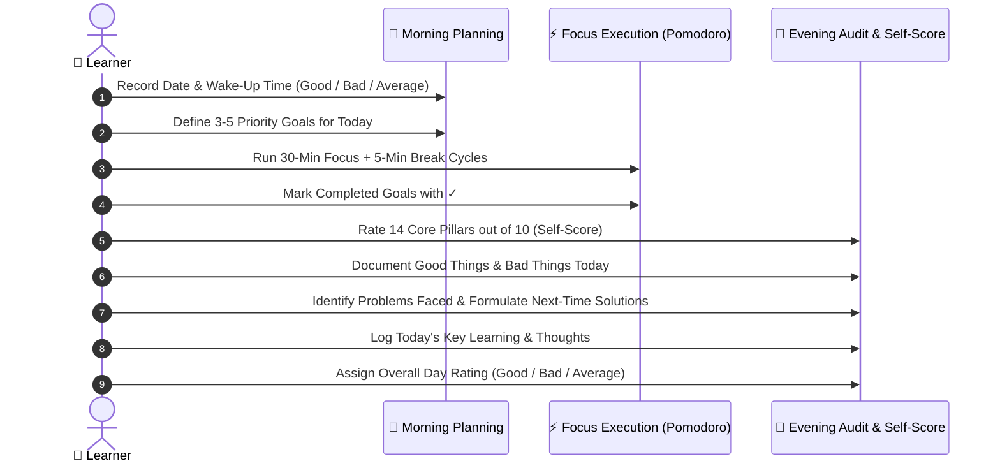
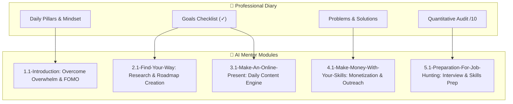

# 📓 Professional Diary: Daily Execution & Mastery System

<div align="center">

### **Turn Knowledge into Action • Transform Daily Habits • Master Your Career**

[](#-folder-overview--asset-analysis)
[](#-the-97-day-daily-operating-system)
[](#-the-unbreakable-pillars--core-values)
[](../README.md)

</div>

---

## 📌 Table of Contents
1. [Folder Overview & Asset Analysis](#-folder-overview--asset-analysis)
2. [What is the Professional Diary?](#-what-is-the-professional-diary)
3. [The Unbreakable Pillars & Core Values](#-the-unbreakable-pillars--core-values)
4. [The Goal Deconstruction Hierarchy](#-the-goal-deconstruction-hierarchy)
5. [The 97-Day Daily Operating System](#-the-97-day-daily-operating-system)
6. [💡 How the Professional Diary Helps You](#-how-the-professional-diary-helps-you)
7. [Integration with the AI Mentor Course](#-integration-with-the-ai-mentor-course)
8. [Recommended Workflows (Print, Tablet, Desktop)](#-recommended-workflows)
9. [Files & Direct Links](#-files--direct-links)

---

## 📂 Folder Overview & Asset Analysis

The [`Professional_Diary`](file:///e:/R.K.%20SkillForge/Projects/Courses/free/AI%20Mentor/Professional_Diary) directory serves as the personal accountability engine and daily execution companion for the entire **AI Mentor** curriculum. 

While the course modules provide strategic career frameworks, industry research techniques, and AI-assisted workflows, this folder delivers the physical and digital tools necessary to translate that knowledge into unwavering daily discipline.

```
📁 1.2-Professional_Diary/
├── 📄 Professional_Diary.pdf    # Print-ready & digital tablet journaling edition (3.9 MB)
├── 📝 Professional_Diary.docx   # Fully customizable Microsoft Word source template (102 KB)
└── 📘 README.md                 # System manual, structural analysis & practical user guide
```

### 🔍 In-Depth Asset Breakdown

| File Name | Format | Size | Target Use Case & Capabilities |
| :--- | :---: | :---: | :--- |
| [**`Professional_Diary.pdf`**](Professional_Diary.pdf) | Vector PDF | ~3.9 MB | **High-Fidelity Printable & Tablet Journal:**<br>• Ready for double-sided spiral printing (A4/Letter) or digital stylus apps (GoodNotes, Notability, Samsung Notes, Remarkable).<br>• Preserves clean typography, checkmark boxes, lined reflection areas, and structured rating grids. |
| [**`Professional_Diary.docx`**](Professional_Diary.docx) | Word Document | ~102 KB | **Fully Editable Source Document:**<br>• Built in standard DOCX with structured paragraph templates and styling.<br>• Allows learners to customize pillar ratings, adjust the 30/5 focus split, add personalized company/project trackers, or translate into other languages.<br>• Compatible with Microsoft Word, Google Docs, LibreOffice, and WPS Office. |
| [**`README.md`**](README.md) | Markdown | — | **System Architecture & Operational Manual:**<br>• Explains the psychological and behavioral science behind the diary.<br>• Details how to conduct morning planning, Pomodoro focus cycles, and evening self-scoring audits. |

---

## 🧠 What is the Professional Diary?

The **Professional Diary** is a structured, 97-day personal accountability journal designed to transform aspiring learners into high-performing, self-aware professionals. It bridges the gap between **learning** and **consistent execution**.

Most individuals fail to achieve their career goals not because they lack resources or ambition, but because they lack:
1. **Daily clarity** on what must be executed.
2. **Honest feedback loops** that quantify effort and expose distractions.
3. **Root-cause reflection** to convert mistakes into future solutions.
4. **Sustained consistency** across a 90-to-100 day habit-forming period.



---

## 🏛️ The Unbreakable Pillars & Core Values

At the heart of the diary are the **Pillars of Personal Mastery**. These values must be reviewed daily to cultivate an unshakeable mindset:

> 💬 **Daily Motivation:**  
> *"No matter how small the step, move forward. Stay loyal to the process, and all tasks will fall in place."*

### 🔬 Deep Meaning of Each Value

| Pillar | Core Mantra | Psychological & Behavioral Purpose |
| :--- | :--- | :--- |
| **Hard Work** | *Silent effort. Loud success.* | Replaces empty talk with sustained, focused exertion behind closed doors. |
| **Consistency** | *Small steps. Big results.* | Harnesses compound interest; showing up every single day beats occasional marathon bursts. |
| **Discipline** | *Do it anyway.* | The ability to execute what is required regardless of temporary moods or lack of motivation. |
| **Smart Work** | *Work smarter, grow faster.* | Pairing hard work with leverage, automation, proven frameworks, and prioritized high-impact tasks. |
| **Mindset** | *Think bigger. Grow stronger.* | Cultivates a Growth Mindset where challenges represent opportunities to expand competence. |
| **Belief** | *Believe before you achieve.* | Fosters unwavering conviction in your future potential before external proof arrives. |
| **Push Your Limits** | *Overcome mental boundaries.* | Stepping outside comfort zones to expand cognitive, technical, and emotional capacity. |
| **Focus** | *Protect your attention.* | Ruthlessly eliminating multitasking, notifications, and micro-distractions during work blocks. |
| **Patience** | *Trust the process.* | Resisting the urge for instant gratification; understanding mastery takes deliberate time. |
| **Sacrifice** | *Give up good for great.* | Consciously trading short-term comfort and entertainment for long-term career fulfillment. |
| **Environment** | *Grow where you are supported.* | Curating digital spaces, physical workspaces, and peers that elevate standards. |
| **Learning** | *Learn. Apply. Improve.* | Rejecting passive tutorial watching; immediately building and stress-testing new knowledge. |
| **Health** | *Strong body, strong mind.* | Fueling cognitive performance through quality sleep, hydration, movement, and nutrition. |
| **Good Habit** | *Small habits, big results.* | Automating foundational routines so willpower is reserved for creative problem solving. |
| **Self-Awareness** | *Know yourself. Grow yourself.* | Honest recognition of emotional triggers, blind spots, strengths, and weaknesses. |
| **Small Rewards** | *Celebrate progress, not excuses.* | Dopamine reinforcement loop: complete the goal $\rightarrow$ earn the reward $\rightarrow$ repeat tomorrow. |

---

## 🗺️ The Goal Deconstruction Hierarchy

To prevent feeling overwhelmed, the diary establishes a top-down goal hierarchy that connects your multi-year vision directly to your next 30-minute sprint:



1. **Yearly Goal:** The overarching milestone (e.g., *Transitioning to a Full-Time AI Engineer* or *Launching an AI Consulting Agency*).
2. **Six-Month Goal:** Intermediate milestones (e.g., *Mastering Python fundamentals, building 3 real-world projects, publishing portfolio*).
3. **Monthly Goal:** Granular 30-day targets (e.g., *Complete AI Mentor Modules 01 & 02; write 8 technical LinkedIn posts*).
4. **Weekly Goal:** Concrete deliverables for the next 7 days (e.g., *Build roadmap with AI Mentor skill; outline project README*).
5. **What Did I Learn:** A dedicated milestone section capturing breakthroughs, paradigm shifts, and key lessons.

---

## ⚙️ The 97-Day Daily Operating System

The diary contains **97 identical daily action pages**—providing over 3 full months of relentless, guided execution.

Each day follows a three-part scientific protocol:



### 1. Morning Alignment (5–10 Minutes)
* **Date & Wake-Up Time:** Records when you got out of bed and rates the quality (`Good / Bad / Average`). Tracks circadian rhythm consistency.
* **Goals for Today:** Explicit checklist of highest-leverage tasks. You commit to marking each completed task with a `✓` checkmark.
* **Focus Protocol:** Apply **30 Minutes Deep Focus + 5 Minutes Break**. Repeat the cycle until all daily tasks are accomplished.

### 2. Evening Quantitative Self-Audit (Rate /10)
Rather than guessing whether you were productive, the diary demands a strict numeric audit across **14 distinct metrics**:

| Pillar Dimension | Score Range | Reflection Prompt |
| :--- | :---: | :--- |
| **Hard Work** | `___ / 10` | Did I push through mental resistance and work with genuine intensity? |
| **Consistency** | `___ / 10` | Did I show up today regardless of circumstances? |
| **Discipline** | `___ / 10` | Did I execute what was planned instead of what felt easy? |
| **Sacrifice** | `___ / 10` | Did I say NO to cheap distractions, social scrolling, and trivial comforts? |
| **Smart Work** | `___ / 10` | Did I prioritize high-leverage activities and avoid busywork? |
| **Focus** | `___ / 10` | Did I protect my attention during deep work blocks? |
| **Believer (Faith/Mindset)** | `___ / 10` | Did I maintain optimism and confidence in my long-term vision? |
| **Patience** | `___ / 10` | Did I trust the process without feeling anxious for instant results? |
| **Environment** | `___ / 10` | Did I optimize my surroundings to foster focus and cut noise? |
| **Push Limits** | `___ / 10` | Did I stretch beyond my perceived capability? |
| **Good Habit** | `___ / 10` | Did I maintain routines that serve my energy and mental clarity? |
| **Self-Awareness** | `___ / 10` | Was I honest with myself about my emotional state and distractions? |
| **Mindset** | `___ / 10` | Did I approach difficulties with curiosity and a learning mindset? |
| **Health** | `___ / 10` | Did I drink enough water, eat clean food, move, and sleep well? |

### 3. Qualitative Retrospective & Debugging Loop
* **Good Things Today:** Fosters gratitude and highlights successful patterns to replicate.
* **Bad Things Today:** Identifies time leaks, emotional friction, or unexpected derailments.
* **Problems I Faced Today:** Root-cause analysis of roadblocks (technical hurdles, procrastination, interruptions).
* **Solutions / What I Will Do Next Time:** The active fix. Prevents the same problem from recurring tomorrow.
* **Today's Learning:** Summarizes newly acquired technical concepts, life lessons, or mental models.
* **Notes / Thoughts:** Freeform brain dump for ideas, inspirations, or lingering questions.
* **Day Rating:** Final summary evaluation (`Good / Bad / Average`).

---

## 💡 How the Professional Diary Helps You

The Professional Diary is not just a notebook; it is a **behavioral modification framework**. Here is how it fundamentally changes your learning trajectory:

### 1. Eliminates the "Illusion of Competence"
Many learners spend hours watching tutorials, reading articles, and collecting resources, mistaking passive consumption for genuine skill. 
* The **Goals for Today** checklist and **✓ Mark Rule** force you to ask: *“Did I actually build or execute anything today?”*
* The quantitative score strips away rationalizations and exposes whether real work took place.

### 2. Automates Continuous Retrospective Debugging
Most people repeat the same mistakes for years because they never review what went wrong. The diary's paired prompt:
$$\text{Problems I Faced Today} \longrightarrow \text{Solutions / What I Will Do Next Time}$$
turns everyday friction into an automated post-mortem. You debug your habits exactly like you debug code.

### 3. Provides 97 Days to Habit Automaticity
Research in behavioral psychology shows that complex habits take an average of 66 to 90 days to become second nature. The diary's 97-day structure guarantees that by the time you complete it, consistency, discipline, focus, and self-auditing have become embedded operating habits.

### 4. Maintains Alignment Between Daily Sprints and Grand Vision
It is easy to get lost in minutiae and lose sight of why you are studying. By placing the **Yearly $\rightarrow$ 6-Month $\rightarrow$ Monthly $\rightarrow$ Weekly** hierarchy right at the front of the diary, your daily Pomodoro sessions always serve your long-term career ambition.

### 5. Balances Ambition with Health & Self-Care
High achievers frequently burn out by treating health and rest as optional. By making **Health**, **Wake-Up Time**, and **Small Rewards** core scored components, the diary ensures you sustain peak mental energy over months and years without collapsing.

---

## 🔗 Integration with the AI Mentor Course

The Professional Diary directly accelerates your progress through every single module of the **AI Mentor** curriculum:



* **Module 1.1 (Introduction):** Use the diary’s Unbreakable Pillars to inoculate yourself against shiny object syndrome, FOMO, and information overload.
* **Module 2.1 (Find Your Way):** Transcribe your personalized skill roadmap into the Yearly, 6-Month, Monthly, and Weekly goal sections.
* **Module 3.1 (Make an Online Presence):** Use the daily checklist to track consistency in writing posts on LinkedIn or X, scripting videos, and engaging with peers.
* **Module 4.1 (Make Money With Your Skills):** Log client outreach targets, freelance proposals sent, and analyze client feedback in the "Problems & Solutions" block.
* **Module 5.1 (Preparation for Job Hunting):** Track portfolio project milestones, resume updates, mock interview scores, and professional networking calls.

---

## 🛠️ Recommended Workflows

Choose the workflow that best fits your lifestyle:

### Workflow A: Physical Spiral Binder (Recommended for Deep Focus)
1. Open [`Professional_Diary.pdf`](Professional_Diary.pdf).
2. Print double-sided on quality A4 or US Letter paper.
3. Bind with a spiral coil or place in a 3-ring binder on your desk.
4. Keep a dedicated pen beside it. Filling it out physically in the morning and evening disconnects you from screens and heightens intentionality.

### Workflow B: Digital Tablet & Stylus (iPad / Android Tablet)
1. Import [`Professional_Diary.pdf`](Professional_Diary.pdf) into **GoodNotes**, **Notability**, **Samsung Notes**, or **Xodo**.
2. Handwrite your goals, checkmarks, scores, and reflections with your stylus.
3. Benefit from searchable handwriting, cloud backup, and zero paper waste.

### Workflow C: Desktop / Word Customization
1. Open [`Professional_Diary.docx`](Professional_Diary.docx) in **Microsoft Word** or **Google Docs**.
2. Customize the scoring fields to match your specific industry priorities (e.g., adding GitHub commit streaks, LeetCode ratings, or sales outreach counts).
3. Type your entries daily or save your customized layout as a personalized PDF for printing.

---

## 📁 Files & Direct Links

Access the diary files directly:

* 📄 **Printable Vector PDF:** [**`Professional_Diary.pdf`**](Professional_Diary.pdf) *(3.9 MB)*
* 📝 **Customizable Word Document:** [**`Professional_Diary.docx`**](Professional_Diary.docx) *(102 KB)*
* 🏠 **Return to AI Mentor Curriculum:** [**Master Course README**](../README.md)

---

## 🧭 Navigation

- ⬅️ **Previous Module:** [**`1.1-Introduction` (Lesson 1.1 — What is AI Mentor?)**](../1.1-Introduction/README.md)
- ➡️ **Next Module:** [**`2.1-Find-Your-Way` (Lesson 2.1 — Find Your Way)**](../2.1-Find-Your-Way/README.md)
- 🏠 **Master Curriculum:** [**Root README**](../README.md)

---

<div align="center">

**“No matter how small the step, move forward. Stay loyal to the process, and all tasks will fall in place.”**  
*Part of the R.K. SkillForge AI Mentor Series*

</div>
