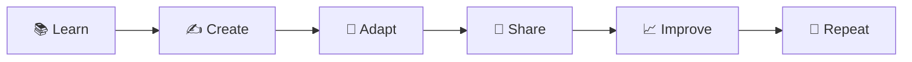
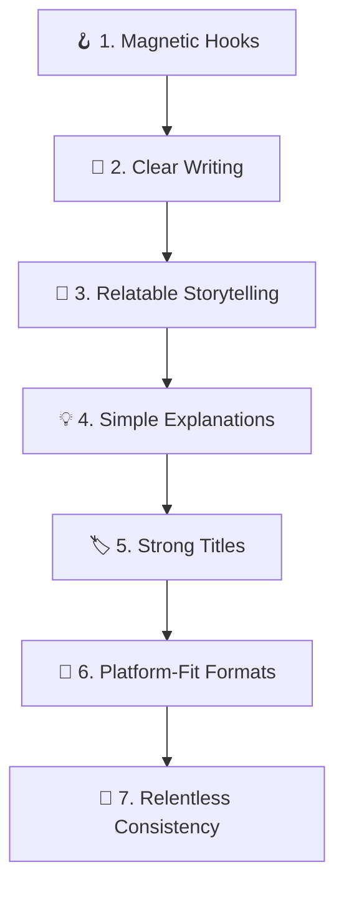
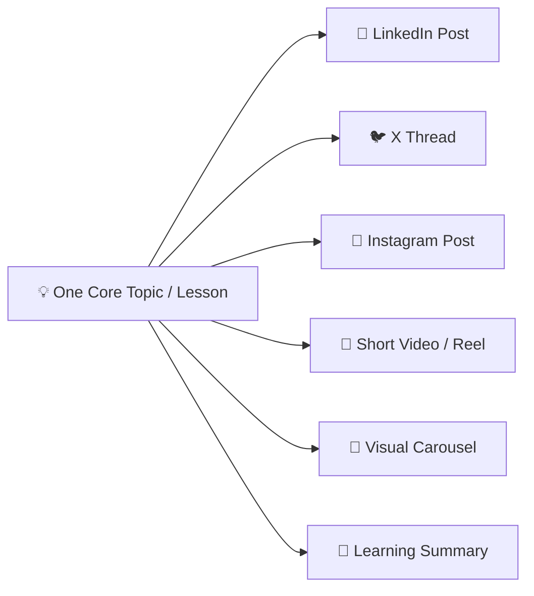

# 🌐 Module 02: Make an Online Presence

> **Lesson 2.1 — Make an Online Presence**  
> *Turning Daily Learning into High-Value Content & Long-Term Professional Credibility*

---

## 🎯 Lesson Objectives & Purpose

The goal of **Make an Online Presence** is to help you consistently turn what you learn, explore, or experience into useful content and build a strong online presence.

$$\mathbf{Learn \longrightarrow Create \longrightarrow Share \longrightarrow Build\ an\ Online\ Presence}$$

Most creators fail because they either run out of ideas, copy generic advice, or optimize solely for fleeting viral metrics rather than real credibility. This framework teaches you how to document your authentic learning journey and distribute it intelligently across platforms.



---

## 🏛️ The 10 Pillars of Content Creation & Personal Branding

### 1. Turn Learning Into Content
When you finish learning or exploring any topic:
- **Identify the single most valuable idea** from what you learned.
- **Turn the idea into clear, actionable content**.
- **Explain the topic in simple, accessible language**.
- **Create content that provides immediate value** rather than simply regurgitating surface information.
- **Select the most suitable content format** based on the nature of the topic.

---

### 2. Create Platform-Specific Content
Never broadcast an identical message across all channels without tailoring:

| Platform | Recommended Tone | Core Format & Style |
| :--- | :--- | :--- |
| **LinkedIn** | Professional, insightful, career-oriented | Detailed case studies, lessons learned, carousels, professional takeaways. |
| **X (Twitter)** | Sharp, punchy, direct | High-impact hooks, concise insights, tactical step-by-step threads. |
| **Instagram** | Visual, engaging, digestible | Carousels, aesthetic summaries, visual workflows, relatable reels. |

> [!IMPORTANT]
> **Tailor the Format, Keep the Core Insight Consistent**  
> Adapt the **writing style**, **length**, **structure**, **hook**, **tone**, and **call to action (CTA)** for each platform while preserving the integrity of the underlying idea.

---

### 3. Create High-Impact Video Content
When a topic lends itself well to video, structure it methodically:
- **Video Idea**: The core premise and promise to the viewer.
- **Hook**: The first 3 seconds that capture attention and pose a problem.
- **Short Script**: Clear, fluff-free narrative.
- **Scene Structure**: Organized progression of key concepts.
- **Voiceover & Spoken Audio**: Natural, engaging delivery.
- **On-Screen Text**: Reinforcing key vocabulary and statistics.
- **Visual Suggestions**: B-roll, diagrams, code screen-shares, or animations.
- **Caption & Description**: Context and discovery keywords.
- **Call to Action**: Directing viewers to practice, comment, or check the repository.

---

### 4. Build a Consistent Content Habit
Establish a sustainable content routine that avoids creative burnout:
- **What to share**: Share your daily lessons, debugging breakthroughs, and "aha!" moments.
- **How often to share**: Consistency beats intensity (e.g., 3 high-quality posts per week).
- **How to organize ideas**: Maintain an idea capture backlog.
- **Avoid unnecessary complexity**: Keep production overhead low so you never dread hitting "publish."

$$\mathbf{Learn \longrightarrow Create \longrightarrow Share \longrightarrow Repeat}$$

---

### 5. Build an Authentic Online Presence
Gradually establish yourself as a dependable voice in your field:
- **Find your content direction** around your genuine domain interests.
- **Develop a recognizable visual and editorial style**.
- **Share the raw learning journey**—including the mistakes and setbacks.
- **Build credibility through usefulness**, not vanity follower counts.
- **Focus on long-term reputation** rather than temporary viral engagement.

---

### 6. Content Creation Best Practices



- **Better hooks**: Promise a specific, tangible outcome or solve an explicit frustration.
- **Clear writing**: Short paragraphs, strong verbs, zero jargon.
- **Audience value**: Always ask: *"What does the reader walk away with?"*
- **Clear calls to action**: Invite meaningful discussion or resource downloads.

---

### 7. Repurpose One Idea Across Formats
Maximize the leverage of every single concept you study:



> [!TIP]
> The goal is to repurpose the idea intelligently to match user behavior across platforms, **not** to spam identical text everywhere.

---

### 8. Honest Feedback & Content Evaluation
Prioritize rigorous, objective critique over empty flattery:

```
"Be direct and honest, not agreeable.
Challenge my assumptions when they're weak.
If I'm wrong, say 'you're wrong' and explain why.
Rate ideas honestly out of 10.
If you're uncertain, say so instead of guessing confidently."
```

#### Standard Content Review Template:
> **Content Score: X / 10**  
> - **What works:** The hook is punchy; the code snippet is relevant.  
> - **What is weak:** The explanation assumes too much background knowledge in line 4.  
> - **How to improve it:** Add an analogy and break paragraph 2 into 2 bullet points.  
> - **Recommended version:** Ready-to-post improved draft.

---

### 9. Avoid Content Hallucinations
Never invent facts, metrics, or credentials simply to sound authoritative:
- **Do not invent statistics, quotes, facts, or achievements.**
- **Clearly state uncertainty** if an industry claim lacks empirical proof.
- **Preserve your authentic experience**: Share what you actually built, not exaggerated claims.
- **Cite primary documentation and credible creators.**

---

### 10. Main Goal & Long-Term Framework

$$\mathbf{Learning \longrightarrow Content \longrightarrow Consistency \longrightarrow Credibility \longrightarrow Online\ Presence}$$

---

## 📦 Assets & Usage Across AI Tools

This module includes:
1. [`content-creating.skill`](content-creating.skill): Complete skill jar archive containing `SKILL.md` and reference modules (`references/video-content.md`, `references/platform-guides.md`, `references/habit-and-presence.md`).
2. [`CONTENT-CREATING-PROMPT.md`](CONTENT-CREATING-PROMPT.md): Universal copy-paste prompt ready for any AI tool (Claude, ChatGPT, Gemini, etc.) or custom instructions.

### Quick Setup:
- **In Claude Projects:** Extract `content-creating.skill` into **Project Knowledge** and paste [`CONTENT-CREATING-PROMPT.md`](CONTENT-CREATING-PROMPT.md) into **Instructions**.
- **In Any AI Chat (Claude, ChatGPT, Gemini):** Copy the prompt from [`CONTENT-CREATING-PROMPT.md`](CONTENT-CREATING-PROMPT.md) into your prompt window.

---

## 🧭 Navigation

- ⬅️ **Previous Module:** [**`2.1-Find-Your-Way` (Lesson 2.1 — Find Your Way)**](../2.1-Find-Your-Way/README.md)
- ➡️ **Next Module:** [**`4.1-Make-Money-With-Your-Skills` (Lesson 4.1 — Make Money With Your Skills)**](../4.1-Make-Money-With-Your-Skills/README.md)
- 🏠 **Master Curriculum:** [**Root README**](../README.md)
