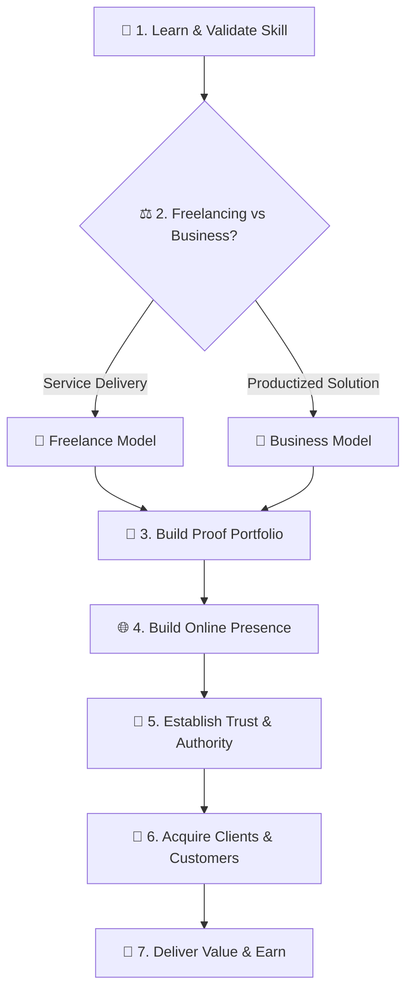

# 💰 Module 03: Make Money With Your Skills

> **Lesson 3.1 — Make Money With Your Skills**  
> *From Competence to Cash Flow: Freelancing, Business Models, Client Acquisition & High-Trust Portfolios*

---

## 🎯 Lesson Objectives & Purpose

The goal of **Make Money With Your Skills** is to guide you step by step from mastering a valuable skill to generating sustainable income through freelancing or launching a business.

$$\mathbf{Learn\ a\ Skill \longrightarrow Choose\ a\ Path \longrightarrow Build\ Portfolio \longrightarrow Build\ Presence \longrightarrow Build\ Trust \longrightarrow Find\ Clients \longrightarrow Earn}$$

Most people get stuck because they believe having a skill is automatically enough. In the real market, earning requires identifying customer pain points, positioning your service, building proof through a portfolio, earning client trust, and closing deals professionally.



---

## 🏛️ The 11 Pillars of Skill Monetization

### 1. Choose a High-Demand Skill
Identify skills that realistically generate commercial income:
- **Interests & natural inclinations**.
- **Existing technical or domain skills**.
- **Past experience & industry background**.
- **Current market demand & hiring budgets**.
- **Learning curve & time to competence**.
- **Viable client service packages**.
- **Freelance vs. business scalability**.

> [!NOTE]
> Do not choose a skill simply because it is trending on social media. Understand why the skill is commercially valuable and recognize its realistic limitations.

---

### 2. Choose Between Freelancing & Starting a Business
Compare both paths objectively before committing:

| Comparison Vector | Freelancing | Business / Agency |
| :--- | :--- | :--- |
| **Primary Asset** | Your individual time, skills, and direct labor. | Systems, productized assets, and teams. |
| **Initial Budget** | Low to zero startup capital required. | Moderate to high capital for tools, ads, and infrastructure. |
| **Risk Profile** | Lower financial risk; income tied to hours worked. | Higher financial and operational risk. |
| **Customer Acquisition** | Direct networking, job boards, and client referrals. | Sales funnels, brand marketing, and partnerships. |
| **Time to First Dollar** | Fast (days to weeks with proper outreach). | Slower (requires validation, packaging, and setup). |
| **Long-Term Scaling** | Capped by personal hourly availability. | High leverage and enterprise equity value. |

---

### 3. Step-by-Step Earning Plan
Follow a structured execution path from learning to income:

$$\mathbf{Learn \longrightarrow Practice \longrightarrow Build \longrightarrow Offer \longrightarrow Find\ Clients \longrightarrow Deliver \longrightarrow Improve \longrightarrow Grow}$$

- **Focus on the next immediate milestone** rather than trying to do everything simultaneously.
- **Master the core deliverable** before attempting to scale or automate.

---

### 4. Find Customers & Clients
Master the fundamentals of ethical, effective client acquisition:
- **Identify high-value targets**: Know exactly who has the budget and urgent need for your service.
- **Where clients hang out**: Professional networks, niche communities, job boards, and local business ecosystems.
- **Professional outreach**: How to send tailored, value-first messages instead of generic spam.
- **Service presentation**: Pitching outcomes and ROI rather than listing technical features.
- **Follow-up strategy**: Systematic, polite follow-ups that close deals.
- **Retention**: Turning initial one-off gigs into recurring monthly retainers.

---

### 5. Recommend Online Platforms & Early-Stage Focus
Select the right channels based on your specific offering:
- **Freelance marketplaces**: Upwork, Fiverr, Toptal, Contra.
- **Professional networking**: LinkedIn, Twitter/X, GitHub.
- **Specialized communities**: Slack groups, Discord servers, industry forums.

> [!TIP]
> **Focus on ONE Primary Platform First**  
> Early on, dominate a single platform that best fits your target client. Master your profile, build visibility, and collect social proof before expanding to secondary platforms.

---

### 6. Build a High-Converting Portfolio
Your portfolio should demonstrate proof of competence and business outcomes, not just code:
- **Number of projects**: 2 to 3 polished, in-depth case studies beat 10 superficial tutorials.
- **Case Study Anatomy**:
  1. **The Problem:** What specific business friction did this solve?
  2. **The Process:** How did you research, architect, and build the solution?
  3. **The Result:** What measurable impact or efficiency was achieved?
  4. **The Stack:** What technical skills and tools were leveraged?
- **No real clients yet?** Build realistic concept projects, solve real problems for open-source tools, or perform an audit for an existing business.

---

### 7. Build an Online Presence & Personal Brand
- Build a profile that immediately communicates: *"Who I help, how I help them, and the results I deliver."*
- Consistently share your work, behind-the-scenes problem solving, and client wins.
- Let your portfolio + online content do the heavy lifting of pre-selling your expertise.

---

### 8. Build Trust & Credibility
Clients hire people they trust to deliver on time without drama:
- **Clear, transparent communication**.
- **Strict adherence to deadlines**.
- **Transparent pricing and deliverables**.
- **Authentic testimonials and verified case studies**.

> [!CAUTION]
> **Zero Tolerance for Fake Social Proof**  
> Never fabricate testimonials, fake client reviews, or claim achievements you did not perform. A single discovered lie permanently destroys professional credibility.

---

### 9. Honest Evaluation & Business Idea Scoring
Evaluate monetization strategies objectively without false hype:

```
"Be direct and honest, not agreeable.
Challenge my assumptions when they're weak.
If I'm wrong, say 'you're wrong' and explain why.
Rate ideas honestly out of 10.
If you're uncertain, say so instead of guessing confidently."
```

#### Evaluation Blueprint:
> **Monetization Score: X / 10**  
> - **What works:** Clear value proposition, strong demand for this stack.  
> - **What is weak:** Target market consists of early startups that lack purchasing budgets.  
> - **Main risk:** Long sales cycle without recurring cash flow.  
> - **How to improve it:** Reposition service toward mid-market e-commerce stores with existing revenue.

---

### 10. Accuracy & Avoiding Financial Hallucinations
- **Never invent income figures or salary estimates.**
- **Do not invent client demand or market trends.**
- **Never make unrealistic "get rich quick" promises.**
- **Distinguish verified financial facts from general estimates.**

---

### 11. Main Goal & Core Framework

$$\mathbf{Learn \longrightarrow Choose\ Path \longrightarrow Portfolio \longrightarrow Presence \longrightarrow Trust \longrightarrow Clients \longrightarrow Value \longrightarrow Earn \longrightarrow Grow}$$

---

## 📦 Assets & Usage Across AI Tools

This module includes:
1. [`make-money.skill`](make-money.skill): Complete skill jar archive containing `SKILL.md` and reference modules (`references/templates.md`).
2. [`MAKE-MONEY-PROMPT.md`](MAKE-MONEY-PROMPT.md): Universal copy-paste prompt ready for any AI tool (Claude, ChatGPT, Gemini, etc.) or custom instructions.

### Quick Setup:
- **In Claude Projects:** Extract `make-money.skill` into **Project Knowledge** and paste [`MAKE-MONEY-PROMPT.md`](MAKE-MONEY-PROMPT.md) into **Instructions**.
- **In Any AI Chat (Claude, ChatGPT, Gemini):** Copy the prompt from [`MAKE-MONEY-PROMPT.md`](MAKE-MONEY-PROMPT.md) into your chat window.

---

## 🧭 Navigation

- ⬅️ **Previous Module:** [**`3.1-Make-An-Online-Present` (Lesson 3.1 — Make an Online Presence)**](../3.1-Make-An-Online-Present/README.md)
- ➡️ **Next Module:** [**`5.1-Preparation-For-Job-Hunting` (Lesson 5.1 — Preparation For Job Hunting)**](../5.1-Preparation-For-Job-Hunting/README.md)
- 🏠 **Master Curriculum:** [**Root README**](../README.md)
