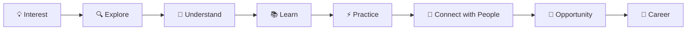
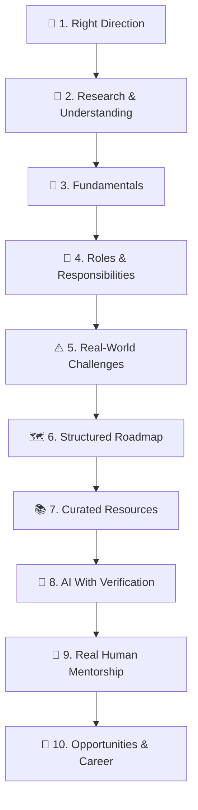
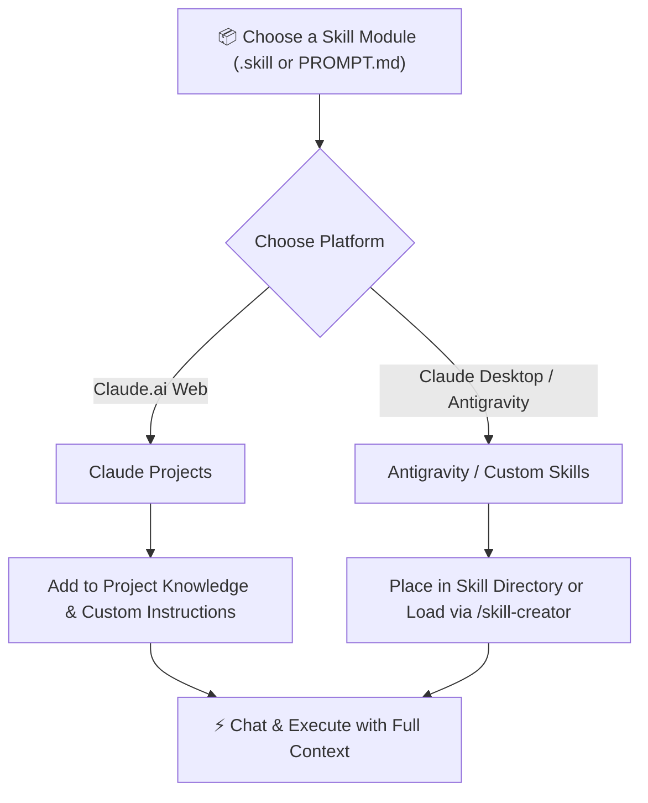

# 🚀 AI Mentor

<div align="center">


### **From Interest to Passion, From Passion to Career**

[](https://www.youtube.com/watch?v=YOUR_YOUTUBE_VIDEO_ID)
[](#-course-overview)
[](#-course-overview)
[](#-course-overview)

</div>

> [!TIP]
> 🎥 **Local Course Preview Video:** [Watch `Media/AI Mentor preview Video.mp4`](Media/AI%20Mentor%20preview%20Video.mp4)  
> *(To link your public YouTube upload, replace `YOUR_YOUTUBE_VIDEO_ID` in the badge link above).*

---

## 📋 Course Overview

**AI Mentor** helps learners explore a topic, understand its real-world value, identify industries and career roles, understand required skills and responsibilities, discover challenges and opportunities, and create a practical learning roadmap.

| Feature / Metadata | Details |
| :--- | :--- |
| **Course Title** | **AI Mentor** |
| **Subtitle / Tagline** | *Interest → Passion → Career* |
| **Instructor / Creator** | **R.K. SkillForge** |
| **Difficulty Level** | **Beginner** |
| **Teaching Language** | **English / Hindi / Hinglish** |
| **Total Number of Lessons** | **5 Comprehensive Lessons** (5 Modules) |
| **Course Pricing & Type** | **Free (🆓 YouTube / GitHub)** |
| **Access Duration** | **Lifetime Access** |
| **1:1 Mentorship Included** | **No** (Framework provided to find & connect with real industry mentors) |

---

## 🎯 What You'll Learn

By the end of **AI Mentor**, learners will be able to:

- **Explore** a topic, skill, technology, role, or career direction.
- **Understand** its real-world value, applications, industries, and opportunities.
- **Identify** relevant roles, responsibilities, required skills, and career paths.
- **Separate fundamentals** from rapidly changing tools, technologies, and trends.
- **Identify what to focus on first** instead of trying to learn everything.
- **Understand real-world challenges** that may not be covered in a typical roadmap.
- **Build a practical step-by-step learning roadmap**.
- **Find and evaluate** relevant free and paid learning resources.
- **Use AI** for research, learning, practice, feedback, and repetitive tasks without becoming dependent on it.
- **Understand when AI may be uncertain or make mistakes** and learn how to double-check important information.
- **Learn why real human mentors are important**, especially for experience, judgment, feedback, context, and career decisions.
- **Learn how to find and connect with people** who have real experience in the chosen field.
- **Learn how to approach professionals**, ask meaningful questions, seek guidance or consulting, and build professional relationships.
- **Connect learning with real-world opportunities** and a possible career direction.

### 🧭 Core Learning Journey



---

## 📌 Requirements & Prerequisites

### Requirements
- **Interest** in learning and exploring new things.
- **Basic computer and internet knowledge**.
- **Willingness** to research, learn, practice, and take action.
- **Openness** to exploring different career and learning opportunities.
- **Willingness to question information** and verify important information instead of accepting every AI-generated answer as correct.
- **Willingness to learn** from both AI and real people with relevant experience.

### Prerequisites
- **No advanced technical knowledge is required.**
- You can start with any:
  - **Topic**
  - **Skill**
  - **Technology**
  - **Role**
  - **Career**
  - **Business idea**
  - **Learning goal**
- **AI Mentor** can help you explore it from the beginning.

> [!IMPORTANT]
> **AI is a tool, not an unquestionable source of truth.**  
> Learners should develop independent thinking and double-check important information, especially when making career, technical, financial, business, or other real-world decisions.

---

## 🧩 The Problem & The SkillForge Solution

### ❌ The Problem

| Problem Area | What Learners Experience |
| :--- | :--- |
| **Lack of Knowledge** | People may be interested in a field without understanding its real-world applications, industries, roles, skills, challenges, or opportunities. |
| **Too Many Resources** | Thousands of courses, videos, tools, roadmaps, and communities can make it difficult to identify what is actually worth learning. |
| **FOMO & Constant Change** | New technologies and trends appear continuously, creating pressure to learn everything and making it difficult to distinguish lasting fundamentals from temporary trends. |
| **Roadmaps Without Real-World Context** | Many roadmaps explain what to learn, but may not explain enough about real responsibilities, challenges, expectations, or opportunities. |
| **Lack of Human Mentorship** | AI can explain concepts and provide guidance, but it cannot replace the value of someone who has actually experienced the field. |
| **AI Can Make Mistakes** | AI can provide incorrect, outdated, incomplete, or misleading information. Learners may trust an answer simply because it sounds confident: *“How do I know whether the information I received is actually correct?”* |

#### What a Real Human Mentor Provides:
- **Real-world experience**
- **Personal feedback**
- **Context**
- **Professional judgment**
- **Practical advice**
- **Career perspective**
- **Lessons from mistakes and experience**
- **Guidance based on situations that may not exist in a roadmap**

---

###  The SkillForge Solution

AI Mentor brings all the critical pieces together into an actionable, cohesive framework:



1. **Right Direction**: Understand which learning or career direction matches the learner's interest and goals.
2. **Research & Understanding**: Explore the topic deeply instead of relying on a single answer or resource.
3. **Fundamentals**: Identify knowledge and skills that remain valuable even when tools and technologies change.
4. **Roles & Responsibilities**: Understand what different roles actually do and what skills they require.
5. **Challenges**: Understand the real-world difficulties involved in learning and working in the field.
6. **Roadmap**: Create a practical path showing what to learn, practice, build, and apply.
7. **Resources**: Find relevant free resources and suitable paid courses.
8. **AI With Verification**: Use AI to accelerate research, learning, practice, and repetitive work—but do not blindly trust AI.
   - AI Mentor encourages learners to follow:  
     $$\text{Ask} \longrightarrow \text{Research} \longrightarrow \text{Verify} \longrightarrow \text{Compare} \longrightarrow \text{Understand} \longrightarrow \text{Decide}$$
   - Important information should be double-checked using reliable sources and, when appropriate, experienced professionals.
9. **Real Human Mentorship**: Helps learners understand how to find and connect with real people who have experience in the chosen field. The goal is not simply to find a mentor, but to learn from people who have actually faced the challenges, made decisions, built skills, and worked in the real world.
10. **Opportunities**: Connect learning and skills with real-world career, industry, freelance, business, and other opportunities.

---

### 🤝 Human + AI: The AI Mentor Philosophy

> [!NOTE]
> **AI can help you learn faster. Real people can help you understand reality.**  
> The strongest approach is not AI vs. Mentor. It is:  
> **AI + Fundamentals + Real People + Practical Experience**

```
Don't learn everything.
Understand what matters.
Build strong fundamentals.
Use AI wisely.
Verify important information.
Learn from real people.
Take action.
Keep improving.
```

$$\mathbf{Interest \longrightarrow Passion \longrightarrow Career}$$

---

## 🗂️ Course Curriculum & Directory Structure

The course is organized into 5 structured modules matching the repository folders. Each module includes a comprehensive curriculum guide, practical frameworks, and production-ready Claude.ai `.skill` packages and prompts:

| Module / Folder | Lesson | Skill Asset | Prompt Guide | Overview |
| :--- | :--- | :--- | :--- | :--- |
| [**`00-Introduction/`**](00-Introduction/README.md) | **Lesson 0.1** | — | — | Course orientation, core mission, problem breakdown, and overcoming FOMO. |
| [**`01-Find-Your-Way/`**](01-Find-Your-Way/README.md) | **Lesson 1.1** | [`ai-mentor.skill`](01-Find-Your-Way/ai-mentor.skill) | [`PROMPT.md`](01-Find-Your-Way/PROMPT.md) | Moving from Interest to Career, fundamentals vs. trends, research, roadmaps, and connecting with real mentors. |
| [**`02-Make-An-Online-Present/`**](02-Make-An-Online-Present/README.md) | **Lesson 2.1** | [`content-creating.skill`](02-Make-An-Online-Present/content-creating.skill) | [`PROMPT.md`](02-Make-An-Online-Present/PROMPT.md) | Turning learning into content, platform-specific strategies (LinkedIn, X, Instagram), video scripting, and habit building. |
| [**`03-Make-Money-With-Your-Skills/`**](03-Make-Money-With-Your-Skills/README.md) | **Lesson 3.1** | [`make-money.skill`](03-Make-Money-With-Your-Skills/make-money.skill) | [`PROMPT.md`](03-Make-Money-With-Your-Skills/PROMPT.md) | Freelancing vs. business, customer acquisition, portfolio building, client trust, and step-by-step monetization. |
| [**`04-Preparation-For-Job-Hunting/`**](04-Preparation-For-Job-Hunting/README.md) | **Lesson 4.1** | [`job-hunting.skill`](04-Preparation-For-Job-Hunting/job-hunting.skill) | [`PROMPT.md`](04-Preparation-For-Job-Hunting/PROMPT.md) | Role analysis, skill prioritization (`Must → Should → Later`), soft skills, interview prep, and job readiness scoring. |
| [**`Professional_Diary/`**](Professional_Diary/README.md) | **Companion** | [`Professional_Diary.pdf`](Professional_Diary/Professional_Diary.pdf) | [`Professional_Diary.docx`](Professional_Diary/Professional_Diary.docx) | 97-day personal accountability journal, 14-pillar daily self-scoring audit, Pomodoro focus protocol, and habit tracking system. |

---

## 🛠️ How to Use Skills in Claude.ai & Antigravity

This repository includes pre-built `.skill` packages (Skill Jars) and prompt templates that turn Claude.ai or Antigravity into specialized autonomous mentors.



### Method 1: Using with Claude.ai Projects (Recommended for Claude Pro/Team)
1. **Create a Project**: Go to [Claude.ai](https://claude.ai) and click on **Projects** → **Create Project** (e.g., name it `"AI Mentor"`).
2. **Upload Knowledge Files**:
   - Rename any `.skill` file (e.g., `ai-mentor.skill`) to `.zip` and extract its contents (`SKILL.md` and `references/`).
   - Upload the extracted markdown files (`SKILL.md`, `references/*.md`) directly into your project's **Project Knowledge**.
3. **Set Project Instructions**:
   - Open the module's [`PROMPT.md`](01-Find-Your-Way/PROMPT.md) file from this repository.
   - Copy the entire prompt block and paste it into **Set Project Instructions**.
4. **Interact**: Start a chat inside your project. Claude will now operate strictly under the skill guidelines, scoring ideas honestly out of 10, preventing hallucinations, and prioritizing fundamentals!

### Method 2: Using in Any Claude Chat (Free / Direct Use)
1. Open a new chat at [Claude.ai](https://claude.ai).
2. Open the [`PROMPT.md`](01-Find-Your-Way/PROMPT.md) file of the desired module.
3. Copy the system prompt and paste it into your chat as your initial instruction.
4. Provide your topic, skill, portfolio, or career goal!

### Method 3: Using in Antigravity / Claude Code CLI
1. Unzip the `.skill` file into your local skills directory:
   ```bash
   # Example: Extracting ai-mentor.skill
   tar -xf 01-Find-Your-Way/ai-mentor.skill
   ```
2. Antigravity will automatically discover the `SKILL.md` and make it callable as a skill.

---

## ❓ Frequently Asked Questions (FAQs)

| Question | Answer |
| :--- | :--- |
| **Who is AI Mentor for?** | Anyone who wants to explore a new topic, skill, technology, role, or career opportunity. |
| **Do I need technical knowledge?** | No. Basic computer and internet knowledge is enough to start. |
| **What can I give to AI Mentor?** | You can provide a topic, title, skill, technology, role, career, or idea you want to explore. |
| **Does AI Mentor provide a roadmap?** | Yes. It helps create a structured learning roadmap based on the selected direction. |
| **Does it provide free resources?** | Yes. It can identify relevant free learning resources. |
| **Does it provide paid courses?** | Yes. Suitable paid courses and resources can also be recommended. |
| **Can it explain job roles?** | Yes. It can explain roles, responsibilities, required skills, challenges, and opportunities. |
| **Does it focus only on trending technologies?** | No. AI Mentor focuses on fundamentals while also helping learners understand changing tools and trends. |
| **Can I use AI while learning?** | Yes. AI can be used for research, learning, practice, and repetitive tasks without becoming dependent on it. |
| **Does AI Mentor replace a real mentor?** | No. It provides guidance, while a real mentor can provide personal experience, feedback, and perspective. |
| **What is the main goal?** | To help learners understand what to learn, where to focus, and how to move toward opportunities. |

### 🔍 Critical Verification Q&A

**Q: How does AI Mentor help learners avoid mistakes from AI and benefit from real human mentorship?**

**A:** AI Mentor teaches learners to use AI as a supporting tool, not as a source of unquestionable truth. AI can make mistakes, provide outdated information, or misunderstand a situation, so learners are encouraged to double-check important information, compare reliable sources, and use their own judgment.

---

## 🤝 Contributing & Community

We believe in open, accessible education for everyone.

If you found a resource that helped you, identified an outdated recommendation, or want to contribute an improved explanation:
1. Fork this repository.
2. Create your feature branch (`git checkout -b feature/improvement`).
3. Commit your changes (`git commit -m 'Add valuable resource'`).
4. Push to the branch (`git push origin feature/improvement`).
5. Open a Pull Request.

---

## 📄 License & Credits

Created with ❤️ by **[R.K. SkillForge](https://github.com/RK-SkillForge)**.  
Dedicated to helping learners transition from **Interest → Passion → Career**.
